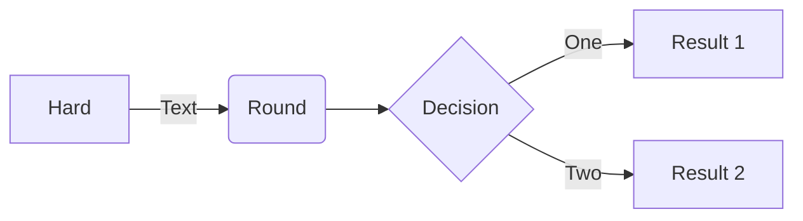

# Latex формулы
## ФИО: Пшеничников Максим; 021 группа; 11 класс

$$x=\frac{-b\pm \sqrt{b^2-4ac}}{2a}$$
$$W=\frac{CU^2}{2}+\frac{LI^2}{2}=\frac{L\mathrm{I}{m}^{2}}{2}=\frac{C\mathrm{U}{m}^{2}}{2}=const$$

$$T=2\pi\sqrt{\frac{l}{g}}$$

$$I=\frac{\Delta q}{\Delta t}$$
$$\sum_{i=1}^{n}\mathrm{I}{i}^{}\mathrm{R}{i}^{}=\sum_{i=1}^{n}\mathrm{ℰ}_{i}^{}$$

